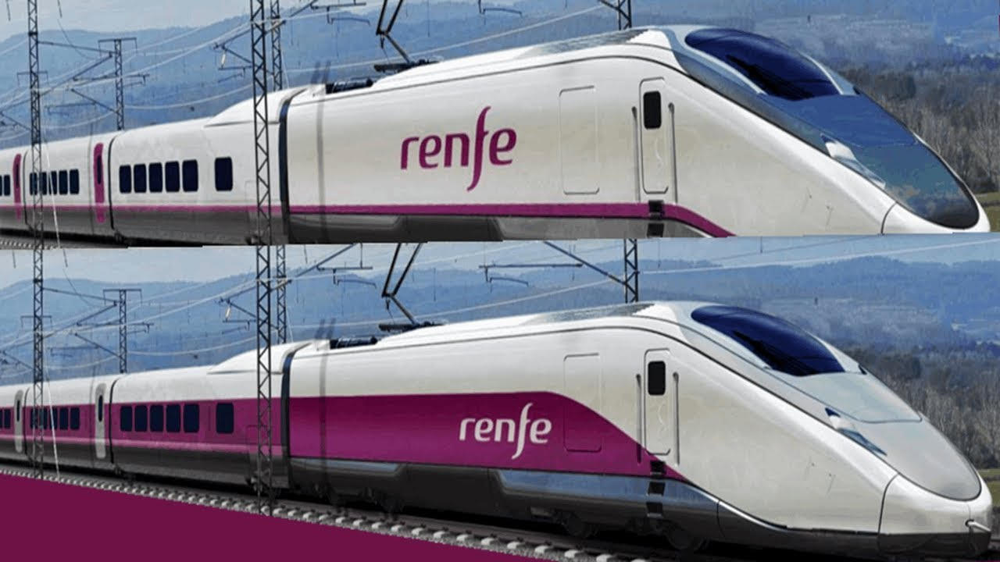

# Train-Ticket-Price-Prediction
Solves Kaggle Problem of finding dynamic price of RENFE Spanish Bullet Train


# Introduction:

Rail transport in Spain operates on four rail gauges and services are operated by a variety of private and public operators. The total route length in 2012 was 16,026 km (10,182 km electrified)

Most railways are operated by Renfe Operadora; metre and narrow-gauge lines are operated by FEVE and other carriers in individual autonomous communities. It is proposed and planned to build or convert more lines to standard gauge,including some dual gauging of broad-gauge lines, especially where these lines link to France, including platforms to be heightened.

Spain is a member of the International Union of Railways (UIC).

# Dataset

The dataset contains following columns

```
1. id
2. company
3. origin
4. destination
5. departure
6. arrival date
7. duration
8. vehicle_type
9. vehicle_class
10. price	fare
11. seats
12. meta
13. insert_date
```
The dataset has 13 rows and 100million+ rows.   
We partition the data and use dataset having and 3.5 million+ rows 


# Approach 
1. Data preparation
2. Extrapolatory Data Analysis
3. Feature Engineering
4. Preparing Training and Testing data
5. Training the regression model
6. Analyze the model performance using various metrics

# Requirements and Installation

1. Python 3.8.5
2. Run ```pip install -r requirements.txt``` to install all relevant libraries and dependencies for this project. 

# Contribute
Please star the repository if you liked the work and feel free to create a pull request and contribute to the project.
